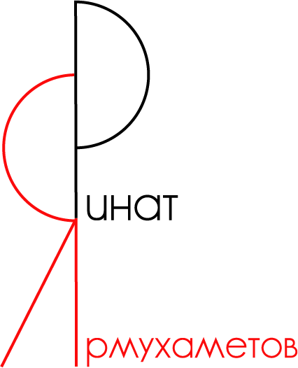

<!-- ### Привет, меня зовут Ринат😃 -->

<!-- * Учу react, express, mongodb 🧑‍🎓
* Стараюсь писать понятный код ✏️ -->

  <picture>
    <source srcset="./icons/logo_Rinat_white.png" media="(prefers-color-scheme: dark)">
    
  </picture>

***

<!-- 

  
   
   
  
  
  
  
  
  
  
  
  

  -->

 <!-- ### Статистика :  -->

 

<!--   -->

