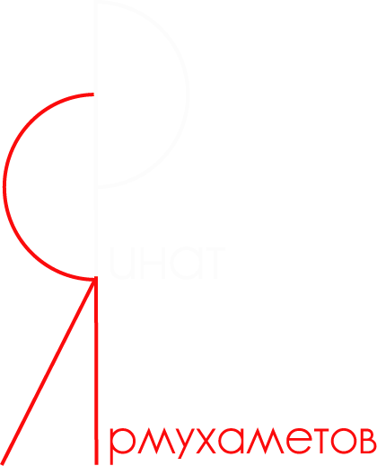

### Привет, меня зовут Ринат😃

* Учу react, node.js 🧑‍🎓
* Стараюсь писать понятный код ✏️
* Студент Яндекс.Практикум, *Веб-разработчик*:space_invader:

***

  

***

### Контакты 

    
    
  

  
### Технологии и инструменты

  
  
  
  
  
  
  

 ### Статистика : 
 

 <!--  -->

<!--
**ri-yarm/ri-yarm** is a ✨ _special_ ✨ repository because its `README.md` (this file) appears on your GitHub profile.

Here are some ideas to get you started:

- 🔭 I’m currently working on ...
- 🌱 I’m currently learning ...
- 👯 I’m looking to collaborate on ...
- 🤔 I’m looking for help with ...
- 💬 Ask me about ...
- 📫 How to reach me: ...
- 😄 Pronouns: ...
- ⚡ Fun fact: ...
-->
